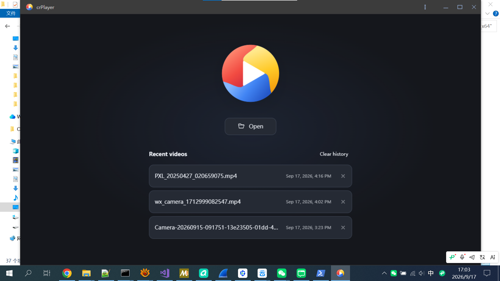
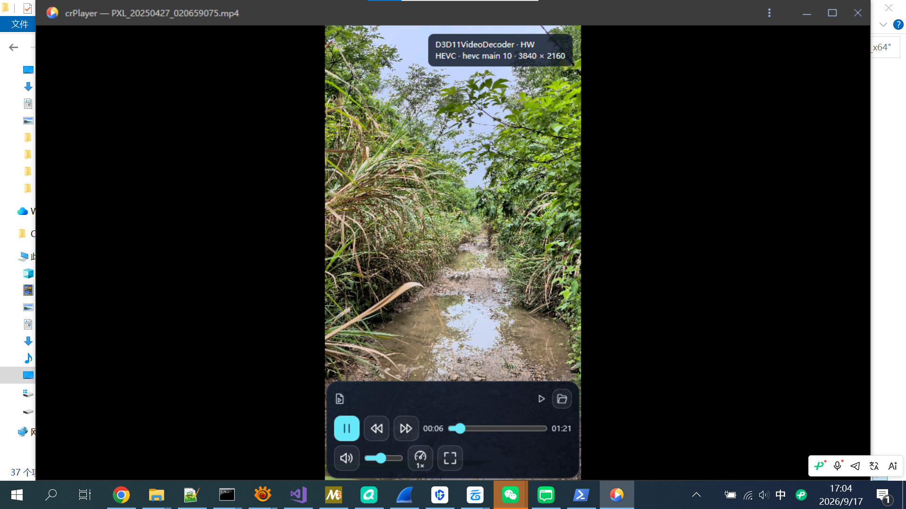
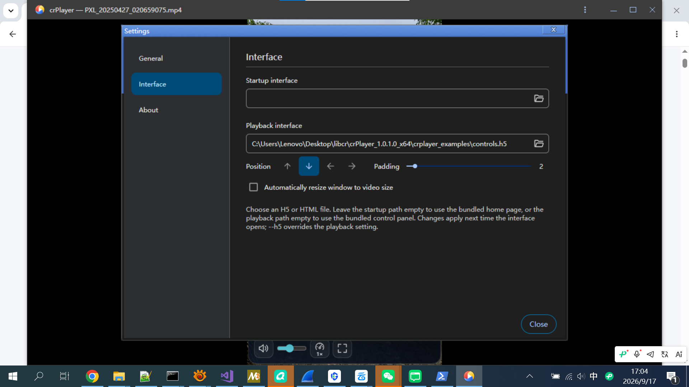

# crPlayer

A free, high-performance desktop video player with an HTML5-customizable interface, built on Chromium v150.

Video is decoded and displayed by the native player. A transparent Blink WebView renders the HTML interface over the video, and a small JavaScript API connects the two. The HTML page does not need a `<video>` element.

## Screenshots

Home page with recent videos:



Video playback with the HTML control panel and decoder information:



Interface settings for startup and playback pages, panel position, and padding:



## Getting started

Extract the complete release package and keep its runtime files and directories together.

```powershell
# Windows: open the home page.
.\crPlayer.exe

# Play a video with the default control panel.
.\crPlayer.exe "C:\Videos\example.mp4"

# Use a custom HTML interface for playback.
.\crPlayer.exe "C:\Videos\example.mp4" --h5 ".\my-controls.h5"
```

```bash
# Linux
./crPlayer
./crPlayer ./example.mp4
./crPlayer ./example.mp4 --h5 ./my-controls.h5
```

`--h5=./my-controls.h5` is also supported. The `--h5` option requires a video argument. Quote paths containing spaces. Codec support depends on the build and available decoders; an MP4 extension alone does not determine compatibility.

The package includes:

| File | Purpose |
| --- | --- |
| `crplayer_examples/startup.h5` | Home page with Open and recent videos. |
| `crplayer_examples/controls.h5` | Default playback controls, including seeking, volume, speed, fullscreen, and opening another video. |
| `crplayer_examples/minimal.h5` | A smaller interface example. |

These are ordinary files shipped beside the executable, not HTML compiled into the executable. Keep `crplayer_examples` with the application when moving or upgrading it.

## Choosing an interface

Settings → Interface provides separate startup and playback paths.

- An empty startup path selects the bundled `startup.h5`.
- An empty or unset playback path selects the bundled `controls.h5`.
- A configured custom path overrides the bundled page.
- An explicit `--h5` overrides the playback setting for that session.

Changes apply the next time the corresponding interface opens. Selecting the current package's default page stores the default selection rather than a fixed version-directory path.

If a configured page cannot be read, the loader attempts the corresponding page in the current package. An explicit `--h5` does not use this fallback. If playback interface loading ultimately fails, the application displays “Unable to load the control panel file.” Startup page failures have a separate message. Check the exact path in `debug.log` when diagnosing a failure, especially after moving or upgrading the package.

H5 files are read asynchronously after the window is shown, with a limit of 4 MiB per file. `.h5` means plain UTF-8 HTML here, not an archive or HDF5 file.

## Writing an H5 page

Use a self-contained HTML fragment with inline CSS and JavaScript. crPlayer wraps it in a document, installs its bridge before your scripts, and loads it as a static `about:blank` document. Relative paths are not resolved against the H5 file's directory.

```html
<style>
  body { margin: 0; background: transparent; color: white; }
  .controls {
    position: fixed;
    bottom: 22px;
    left: 50%;
    transform: translateX(-50%);
    padding: 12px;
    border-radius: 12px;
    background: rgb(20 20 20 / 85%);
  }
</style>
<div class="controls">
  <button id="open">Open</button>
  <button id="toggle" disabled>Play</button>
  <button id="fullscreen">Fullscreen</button>
  <span id="time">0.0 / 0.0</span>
  <span id="error" role="status"></span>
</div>
<script>
  const player = window.crPlayer;
  const toggle = document.getElementById('toggle');

  // Call gesture-protected methods directly from real user interactions.
  document.getElementById('open').onclick = () => player.open();
  toggle.onclick = () => player.toggle();
  document.getElementById('fullscreen').onclick = () =>
    player.setFullscreen(!player.state.fullscreen);

  function render(state) {
    toggle.disabled = !state.ready;
    toggle.textContent = state.paused ? 'Play' : 'Pause';
    document.getElementById('time').textContent =
      `${state.currentTime.toFixed(1)} / ${state.duration.toFixed(1)}`;
    document.getElementById('error').textContent = state.error || '';
    document.documentElement.style.colorScheme = state.dark ? 'dark' : 'light';
  }

  player.addEventListener('statechange', event => render(event.detail));
  render(player.state);
</script>
```

The WebView covers the actual video rectangle and follows its aspect ratio. Letterbox areas are outside the page. Opaque page backgrounds cover the video; use transparent backgrounds where the video should remain visible. The overlay receives input; there is no automatic per-element click-through to native views underneath it.

Inline CSS animations and JavaScript are supported. For overlays synchronized to playback, derive the visual state from `currentTime`, `paused`, and `seeking`. Independent CSS animations do not automatically pause or seek with the video. State updates are not frame-accurate.

The native WebView entrance effect lasts 320 ms and scales from 92% to 100% while fading in. It respects the system's reduced-motion preference. This is separate from animations implemented inside the H5 page.

## JavaScript API

Use `window.crPlayer`. Commands are serialized as JSON, checked by a native V8 callback, and posted to the UI thread. Native state is delivered back to JavaScript through the bridge. There is no local HTTP server, network port, or WebSocket involved.

Methods return no completion Promise or command result. Read `player.state` and subscribe to `statechange` to observe changes; do not assume a command has completed when the method returns. Invalid or unauthorized commands can be ignored without an error event. Names beginning with `__crPlayer` are internal implementation details.

| Method | Behavior | Requires user activation |
| --- | --- | --- |
| `open()` | Opens the native file picker. Canceling preserves the current page/video. | Yes |
| `openRecent(id)` | Opens a video identified by a native history ID, not a file path. | Yes |
| `removeRecent(id)` | Removes one history entry; does not delete the video. | Yes |
| `clearRecent()` | Clears history; does not delete videos. | Yes |
| `play()` | Plays; restarts from the beginning after playback has ended. | No |
| `pause()` | Pauses playback. | No |
| `toggle()` | Toggles play/pause. | No |
| `seek(seconds)` | Seeks to a finite time, clamped to `0…duration`. Pending seeks are coalesced. | No |
| `setVolume(value)` | Sets a finite volume, clamped to `0…1`; does not unmute. | No |
| `setMuted(value)` | Sets mute state; the JS wrapper converts the value to Boolean. | No |
| `setPlaybackRate(value)` | Sets a finite rate, clamped to `0.25…4`. | No |
| `setFullscreen(true)` | Enters fullscreen. | Yes |
| `setFullscreen(false)` | Exits fullscreen. | No |
| `addEventListener('statechange', listener)` | Subscribes to state snapshots in `event.detail`. | No |
| `removeEventListener('statechange', listener)` | Removes a subscription. | No |

Play, pause, toggle, and seek require the player to be ready. Volume and mute persist across launches. Avoid sending commands on every state update unless a change is needed; that can create feedback loops.

### State snapshots

`player.state` is replaced on each update. Its top-level object is frozen; nested values such as the history array are not deeply frozen. Treat all fields as read-only. Modifying JavaScript objects does not modify native player state.

| Field | Type / meaning |
| --- | --- |
| `ready` | Boolean: the playback pipeline is ready. |
| `paused`, `ended`, `seeking`, `buffering` | Boolean playback status flags. |
| `currentTime`, `duration` | Numbers in seconds. |
| `volume` | Number from 0 to 1. |
| `muted` | Boolean. |
| `playbackRate` | Playback speed multiplier. |
| `fullscreen` | Boolean: native window fullscreen state. |
| `error` | Localized error text, or an empty string. |
| `locale` | Application locale, such as `en-US` or `zh-CN`. |
| `fileName` | Video basename; not its complete path. |
| `dark` | Boolean indicating the current dark theme. |
| `recent` | Array of `{id, fileName, openedAt}`; `openedAt` is Unix time in milliseconds. |
| `panelPosition` | `top`, `bottom`, `left`, or `right`. |
| `panelPadding` | Integer from 0 to 36, used as CSS pixels by the bundled panel. |
| `panelPreview` | Boolean: keep the panel visible while Interface settings are being previewed. |

The initial bridge snapshot is minimal. Fields such as `recent`, `dark`, and panel preferences may be absent until the first native update; use defaults when rendering them. Playback time normally updates approximately every 200 ms, with additional notifications for other changes.

Custom pages must implement their own layout and visibility behavior using the panel fields. The native setting does not automatically reposition arbitrary HTML. The bundled panel supports all four positions, defaults to bottom with 22 px padding, and stays visible during settings preview.

## H5 security model

Use H5 pages from sources you trust. crPlayer restricts web capabilities, but the standalone Blink WebView runs in the application's process. These restrictions are not a separate renderer-process sandbox or a guarantee that hostile HTML is safe.

### Resource restrictions

The document is created with this Content Security Policy:

```text
default-src 'none';
style-src 'unsafe-inline';
img-src data:;
font-src data:;
script-src 'unsafe-inline';
connect-src 'none';
worker-src 'none';
media-src 'none';
frame-src 'none';
object-src 'none';
base-uri 'none';
form-action 'none'
```

Consequences and additional WebView settings:

- Inline HTML, CSS, and JavaScript can run. External scripts and stylesheets are blocked. `eval()` and `new Function()` are not permitted by this policy.
- Fetch/XHR/WebSocket connections, workers, embedded frames, plugins, and HTML media resources are blocked by the policy.
- Images are disabled in WebView preferences even though CSP allows `data:` image URLs. Use CSS shapes or inline SVG, as the bundled pages do.
- Remote fonts and local storage are disabled. Do not rely on external font loading or persistent browser storage.
- Adjacent CSS, JS, image, or font files are not automatically accessible. Bundle supported content inline rather than referencing local files or a CDN.

CSP is a resource policy, not a comprehensive native security boundary. In particular, it should not be interpreted as proof of complete navigation isolation, protection from engine vulnerabilities, or protection from a page consuming excessive CPU or memory. The 4 MiB input limit bounds file size, not runtime resource usage.

### Native permissions and user gestures

The bridge exposes only the listed player actions. It does not provide arbitrary file reads, directory listings, shell commands, or an API to open a supplied filesystem path. Opening a new file uses the native picker. Reopening a recent file requires an ID already present in native history.

Before posting a protected command, native code checks and consumes Blink's transient user activation. `open()`, history open/remove/clear, and entering fullscreen require this activation. One activation can authorize only one of these protected operations. Exiting fullscreen does not require activation.

Call protected methods from actual user click or key handlers. A synthetic `.click()` or `dispatchEvent()` does not create activation by itself. The check uses Blink's activation state, not an H5-supplied `trusted` flag. Activation can remain available briefly after real input, so this is not a strict rule that execution must remain inside the original event handler. A page may also consume activation for an action different from the one its UI appears to promise. Trustworthy page design remains necessary.

Playback, seeking, volume, mute, and rate changes do not require user activation. A loaded page can issue those commands automatically. Volume and mute changes persist, and authorized history changes persist. The bridge is therefore intentionally capable of changing player behavior, not a read-only display API.

### Privacy and safe page design

The page receives the current video basename and recent-video names, IDs, and timestamps. Complete recent-file paths are kept on the native side and in the local history file. The history bridge currently exposes up to 20 recent videos to a loaded page; this information should be considered visible to the page's code.

Render filenames, error messages, and other dynamic text with `textContent`, not interpolated `innerHTML`. Do not treat a filename as trusted markup. Keep script dependencies reviewed and inline, and avoid misleading controls that consume a user's activation unexpectedly.

Settings and history are stored in:

- Windows: `%LOCALAPPDATA%\crPlayer\settings.json` and `history.json`.
- Linux: `~/.config/crPlayer/settings.json` and `history.json`.

History removal only removes records. It does not delete media files. Settings are cached for the process lifetime; restart after manually editing them outside the application.
